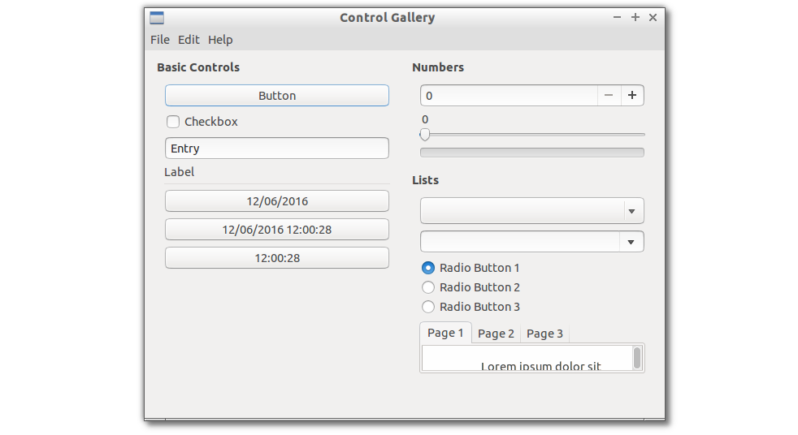

# libui-node


> libui Node.js bindings.

> [libui](https://github.com/andlabs/libui) is a simple and portable (but not inflexible) GUI library in C that uses the native GUI technologies of each platform it supports.

> It is in early stage of development, but is evolving at great pace and is really awesome.

> It could become an awesome, lightweight alternative to Electron to develop multiplatform GUI.

[](https://gitter.im/parro-it/libui-node?utm_source=badge&utm_medium=badge&utm_campaign=pr-badge&utm_content=badge)
[](http://travis-ci.org/parro-it/libui-node)
[](https://ci.appveyor.com/project/parro-it/libui-node)
[](https://npmjs.org/package/libui-node)
[](https://npmjs.org/package/libui-node)

**Linux**


**macOS**


**Windows**


# Supported platform

* Windows: Windows Vista SP2 with Platform Update or newer
* Unix: GTK+ 3.10 or newer
* Mac OS X: OS X 10.8 or newer

# Node version requirement

The project run on any node version > 0.12.

# Installation

We had published a first pre-release to npm.
You can now install `libui-node` as a simple dependency in your project:

```bash
npm install -S libui-node
```

`libui` prebuilt binaries are automatically downloaded after install.

This is tested with:

* Linux 64bit
* Linux 32bit
* Windows 64bit
* macOS

If you get error on windows, check [this node-gyp issue](https://github.com/nodejs/node-gyp/issues/972)


# Documentation

You can find ongoing documentation in [docs folder](docs).

Please look in [examples folder](https://github.com/parro-it/libui-node/tree/master/examples) for working examples.

Some example uses ES6 syntax. We will soon configure babel transpilation for them. Meanwhile, if you are testing the project on Node.js < 6, you can check `examples/core-api.js` that use ES5 syntax.

# Run examples

First, you have to clone the GitHub repo and npm install it:

```bash
git clone https://github.com/parro-it/libui-node.git
npm install
```

Then, to run the control gallery example (requires Node.js >= 6), type:

```bash
npm start
```

For the core api, example, type:

```bash
npm run start-core
```

# Project status

* All current `libui` API, except for [these ones](https://github.com/parro-it/libui-node/issues?q=is%3Aissue+is%3Aopen+label%3A%22Missing+bind%22) are implemented.
* This is not yet battle-tested in a real app, but the control gallery example you saw in the screenshot above is fully working.


# Future directions of the project

This binding is actually implementing low-level API straight to the `libui` ones.
We plan to add another level of API on top of it to simplify GUI building. You can get a taste of how they will be in [example utils.js file](https://github.com/parro-it/libui-node/blob/master/examples/utils.js).

This new API will support transpilation from JSX to further simplify GUI building.

These works will become in future the base for a React-Native like project.

# Contribution & design

* Each `libui` widget implementaion is written in it's own C++ file in `src` folder.
* Each widget is implemented in it's own C++ class, each class is a simple wrapper for related libui C functions.
* There is an header file called `src/ui-node.h` that contains all classes definitions.
* Widget events does not follow `node` convention: if you attach an handler to an event, previous one will be overwritten and never be called. This will be resolved on future high-level API repo, where each widget will be an `EventEmitter` instance.
* We build the project using the awesome [nbind](https://github.com/charto/nbind) tool, that automate the process of linking a straight C++ class to Node.js stuff...

## Useful NPM scripts

* test - run AVA tests && XO linting.
* start - start the control gallery example
* build - rebuild C++ sources

## Related projects

* [libui](https://github.com/andlabs/libui) - Simple and portable (but not inflexible) GUI library in C that uses the native GUI technologies of each platform it supports.
* [nbind](https://github.com/charto/nbind) - Magical headers that make your C++ library accessible from JavaScript

# Contributors

[](https://github.com/parro-it) | 
[](https://github.com/jjrv) | 
[](https://github.com/mischnic) | 
[](https://github.com/kusti8)
---|---|---|---
[Andrea Parodi](https://github.com/parro-it) | [Juha Järvi](https://github.com/jjrv) | [Niklas Mischkulnig](https://github.com/mischnic) | [Gustav Hansen](https://github.com/kusti8)

# License

The MIT License (MIT)

Copyright (c) 2018 parro-it
